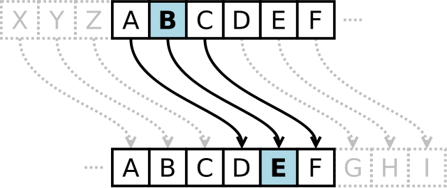

# Контрольная работа #1

В контрольной работе предлагается вскрыть зашифрованное послание. Известно, что шифрование производилось средством шифра Цезаря.
Язык исходного сообщения - английский.
Хоть для его вскрытия можно использовать и полный перебор (brute force), предлагается использовать более сложные, но более интелектуальные техники,
которые применяются для вкрытия других шифров.

Для каждого языка, есть статистики: какая самая часто используемая буква, а какая наименее. По [ссылке](https://eng4school.ru/the_alphabet/687-chastota-vstrechaemosti-bukv.html) можно найти статистику для английского языка. Так самая используемая буква `E`, а редко встречаемая - `Z`.
Именно это и будем использовать для взлома.

## Шифр Цезаря
Шифр Цезаря — это вид шифра подстановки, в котором каждый символ в открытом тексте заменяется символом, находящимся на некотором постоянном числе позиций левее или правее него в алфавите. Например, в шифре со сдвигом вправо на 3, `A` была бы заменена на `D`, `B` станет `E`, и так далее.
Для расшифровки используется обратное преобразование, т.е. сдвиг влево. На сколько символов был произведен сдвиг называется ключом.




### Задание 1  (1 балл)
Реализуйте функцию, которая получает статистику в сообщении. Требуется реализовать функцию, которая подсчитает количество заданного символа в предложении.

```cpp
size_t CountOf(const std::string& str, char sym);
```

Функция возвращает количество символов в `|sym|` в строке `|str|`.


### Задание 2  (1 балл)
Отлично, у нас есть простая понятная функция. Давайте её применим для решения другой задачи.
Нам необходима статистика по всем символам.
Т.е необходимо реализовать функцию, возращающая массив, который содержит количество всех символов.

Например, на вход подается строка `"Aabcddde"`. нам надо подсчитать сколько в этом слове букв `a`, букв `b`, `c`, `d`, `e` и пр.
Что важно, регистр букв не важен.
Для `"Aabcddde"`, мы должны вернуть массив `{2, 1, 1, 3, 1}` (2 буквы `a`, 1 - `b`, 1 - `c`, 3 - `d`, 1 - `e`).

Прототип функции
```cpp
void StatisticsAlphabet(const std::string& str, std::vector<size_t>& out_statistic);
```

Функция заполняет массив `|out_statistic|` основываясь на строке `|str|`. Индекс для символа `a` должен равняться 0, а для `z` - 25.

##### Hint
1. Используйте [функцию `std::tolower`](https://en.cppreference.com/w/cpp/string/byte/tolower)
2. Для переменных типа char тоже применимы арифметические операторы. Например,
```cpp
size_t i = 'b' - 'a'; // i == 1
size_t j = 'a' - 'a'; // j == 0
```
3. Воспользуйтесь методом `std::vector::resize`, чтобы изменить размер массива.
```cpp
std::vector<int> v;
v.resize(15);
v[14] = -100;
```


### Задание 3  (2 балла)
На предыдущем шаге у вас появился массив статистики. Можно каждый раз выводить этот массив в консоль и находить максимальные и минимальные элементы.
Но это не путь настоящих исследователей. Реализуйте функцию, которая найдет индексы 3х самых максимальных элементов в массиве.

```cpp
void Find3Max(const std::vector<size_t>& statistics, size_t& max_index, size_t& second_max_index, size_t& third_max_index);
```


### Задание 4  (1 балл)
Хм... нашли индексы максимальных элементов, а давайте найдем соответсвующие им символы.

```cpp
char IndexToSymbol(size_t index);
```

##### Hint
1. Смотри подсказки из второго задания.


### Задание 5  (2 балл)
Реализуем функцию расшифровки шифра Цезаря по заданному ключу.

```cpp
std::string Decrypt(const std::string& cipher_text, size_t key);
```

### Задание 6  (1 балл)
Как уже говорили, самая используемая буква в английском языке это `E`, а самя редко встречаемая - `Z`.

Все подготовительные шаги мы выполнили. У нас есть три самых используемых буквы в зашифрованном исходном сообщении. Одна из них, с большой вероятностью, это буква `E` в исходном тексте. Так давайте проверим это и сделаем предположение о трех ключах, которые могли использоваться для шифрования.

1. `key1 = IndexToSymbol(max_index) - 'e'`
1. `key2 = IndexToSymbol(second_max_index) - 'e'`
1. `key3 = IndexToSymbol(third_max_index) - 'e'`

Каждым их этих ключей попробуем расшифровать сообщение.

Реализуйте функцию, которая вернет 3 кандидата для открытого текста:

```cpp
void GenerateCandidates(const std::string& cipher_text,
                        const std::vector<size_t>& keys,
                        std::vector<std::string>& candidates);
```

В `|candidates|` должен получиться массив из кандидатов открытого текста на основе ключей из `|keys|` и шифр-текста `|cipher_text|`.


### Задание 7  (12 баллов)
Если вы все правильно выполнили, то успешно пройдут все тесты, и мы разгадаем сокрытое сообщение. Если же вы ошиблись, тогда и клада в 12 золотых вам не видать.


### Заключение
Вот мы и смогли получить кандидатов для исходного сообщения. Наверняка, среди них есть сообщение.
